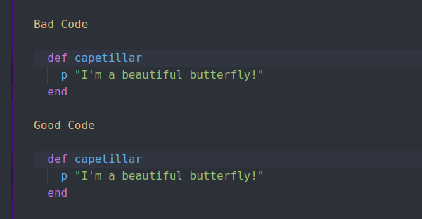
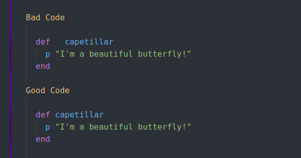
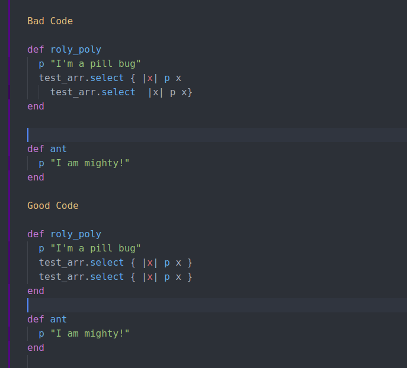
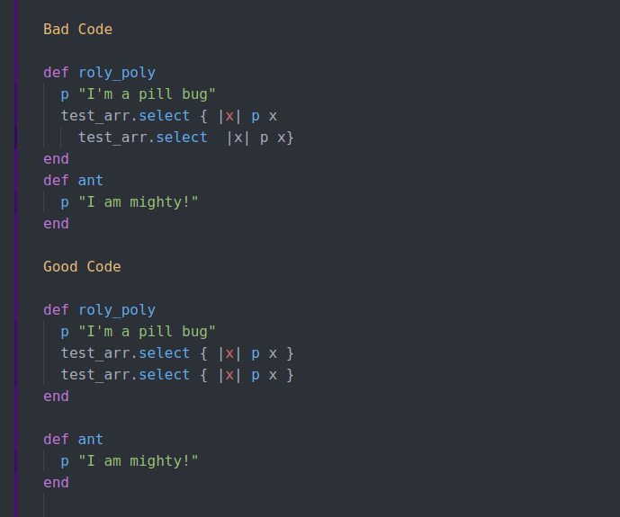
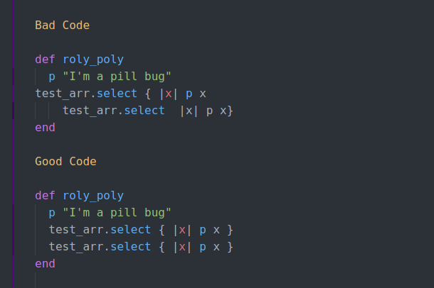
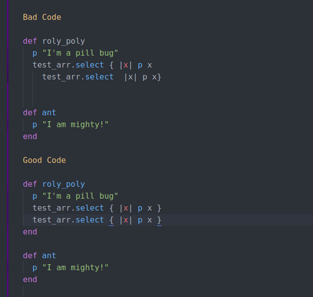
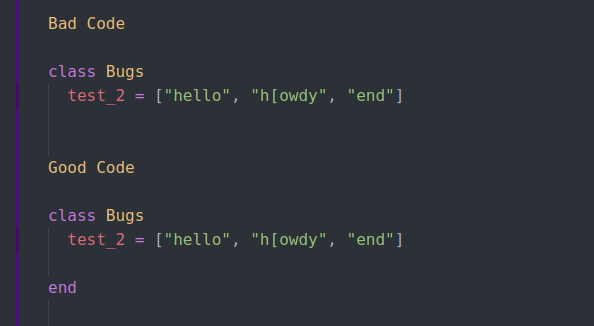
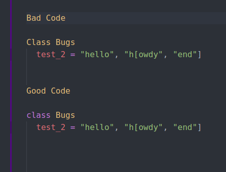
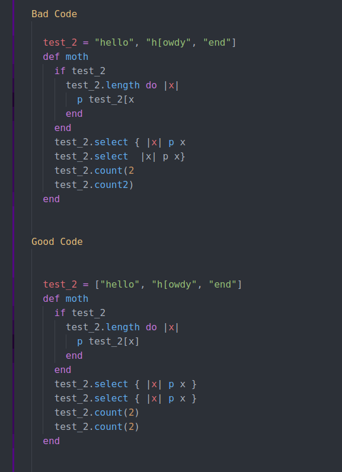

# Ruby Capstone Project (Ruby Linter)

This is Brandon's Ruby Capstone project

This project was compiled by Brandon in the Ruby section of the Microverse course work as the Ruby capstone project. It involved building a linter from scratch to create a real-world-like project.

This linter performs the following tests:

###### Trailing Whitespace:

##### Excess Whitespace:

##### Empty Lines:

##### Missing Empty Line:

##### Indentation Errors:

##### Missing Closing Statement:

##### Missing Final Closing Statement:

##### Incorrect Capitalization of Reserved Word:

##### Missing Matching Bracket:

Particularly noteworthy is the active error correction for when one error comes up because of the existence of another, as in the case of lines 18 and 19 where it appears as two empty lines. With error correction it registers a missing closing statement and what should be an empty line once that closing statement is added, without error correction it would register as two extraneous empty lines and a missing closing statement.

## Built With

-   Ruby
-   Atom
-   Ubuntu
-   Rubocop

## Prerequisities

To get this project up and running locally, you must already have ruby installed on your computer.

## Getting Started

To get your own copy of this project simply clone the repository to your local machine. For instructions on how to run this linter live, skip to the Repl.It instructions below and then click on the Repl.It badge.

**Step 1**: Type the following command into a git shell

<code>git clone <https://github.com/defoebrand/Ruby_Capstone_Linter.git></code>

**Step 2**: Direct a terminal into the directory of the cloned repository by typing:

<code>cd Ruby_Capstone_Linter</code>

**Step 3**: To ensure all necessary dependencies are present, run the following command:

<code>bundle install</code>

## Linting Locally

**Step 1**: With your terminal in the cloned directory type the following command:

<code>ruby ./bin/ruby_linter</code>

**Step 2**: When prompted, enter the relative path of any file you would like to lint. To use the _bad_code_ that comes with this repository type:

<code>./assets/bad_code.rb</code>

## To Lint on Repl.it

**Step 1**: Direct the repository to the replit-readme branch

**Step 2**: Click run.

**Step 3**: When prompted, enter the relative path of the _bad_code_ file as described above under Linting Locally. Edit the file as you see fit and test for any errors listed in the tests outlined above. If you find any incorrect errors, please submit an issue.

## Try It on Repl.It

-   **Note**: Repl.It does not currently support colors so the User Experience may differ between testing online and testing locally.

## To Test with Rspec

**Step 1**: Direct a local terminal to the cloned repository.

**Step 2**: Enter the following command:

<code> rspec ./spec/linter_tester.rb </code>

## Author

👤 **Brandon Defoe**

-   Github: [@defoebrand](https://github.com/defoebrand)
-   LinkedIn: [@defoebrand](https://www.linkedin.com/in/defoebrand/)
-   Gmail: <mailto:defoe.brand@gmail.com>

## 🤝 Contributing

Contributions, issues and feature requests are welcome!

Feel free to check the [issues page](issues/).

## Show your support

Give a ⭐️ if you like this project!

## 📝 License

This project is licensed by Microverse and Notion.so
